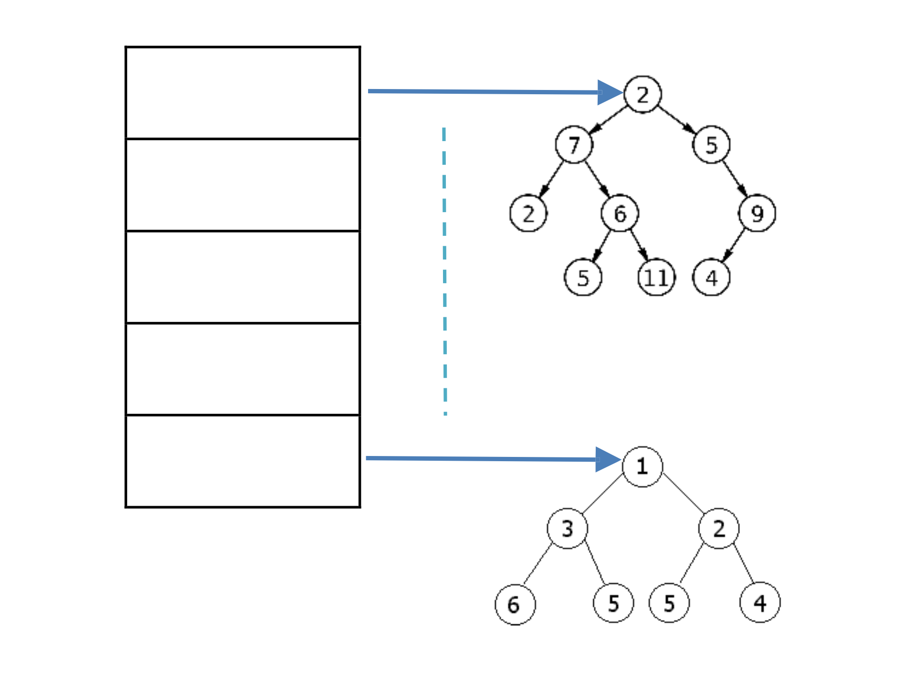

<p align="center">
    
</p>

# CMPS303 Data Structure - Course Project
>Authors : Ali Mohammadian, Mohamed Al-Yazidi, Daniel Izham, Youssef Elshahawy

>Semester : Spring 2020

[](https://GitHub.com/) [](https://GitHub.com/Naereen/)

  [](http://unmaintained.tech/)

Student ID at Qatar University is composed of year of admission and students number. In this project, we aim to implement a structure that improves operations of inserting and searching for a student. To enhance these operations when using tree data structure, we will use hash table that contains trees (*TreeTable*) where each tree holds only data of students admitted in a specific year. Figure below illustrates this concept:

<p align="center">
    
</p>

We will keep data for 20 years so the table length is 20, and the hash function will be h(year)= year % 20. Using ~~linear probing~~ separate chaining, implement the following functionalities in *TreeTable*:

1. Each node in the tree will be used for saving an object of type Student.
2. Student class has: *id (int)*, *name (String)*, *address (String)*, *GPA (double)*.
3. There should be one class that implements the structure above, call it *TreeTable* which has the following methods:

```java
public void insert(Student student) {
    // this method inserts students in the 
    // appropriate tree based on his id
}

public Student search(int id) {
    // it receives an id and return back the 
    // student record or null if it was not found
    return null;
}

public void update(int id) {
    // it receives student’ id and update his 
    // information
}

public Student delete(int id) {
    // it receives student’ id, remove his record 
    // and return it back, or return null
    return null;
}

public void printStudent(int id) {
    // it receives the student id and print his 
    // information
}

public void printTree(int year) {
    // it receives a year and print all the 
    // students records in the treeTable
}

public void printAll() {
    // it prints all the student’s records
}

public void showTree(int year) {
    // it receives a year and print the BST of 
    // that year
}

public void studentGPA(int gpa) {
    // it prints all the students whose GPA is 
    // below the parameter
}
```
4. The main application should have a menu with the following functionalities:
    1. Add new student: which prompts user to enter student’s data, then insert it to the *TreeTable*.

    2. Search for a student: which prompts user to enter an id then search in *TreeTable* and display the result.

    3. Update student information: which allow the user to update the student information.

    4. Delete a student: which prompts user to enter a student id, then remove his record or display a message indicating that this student was not found.

    5. Display student data: which prompts user to enter student id and display his data.

    6. Display students’ data: which prompts user to enter a year, then display students’ data of that year.

    7. Display all students: which display all the students’ data exist in the hash table.

    8. Show Tree: which allows the user to enter a year and then print out the tree of that year.

    9. Display students with less GPA: it prompts user to enter a number, then display students’ data whose GPA is less than the input value.

    10. Save to file: which saves *TreeTable* to a file.

    11. Load data: which loads data from a file to *TreeTable*.

**Project due date : 28th April, 2020**


